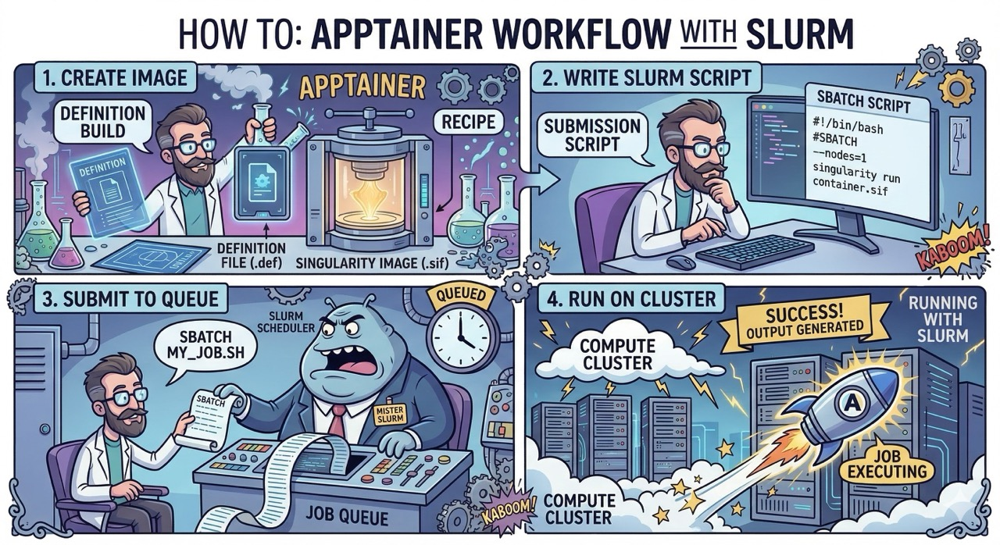

<!-- _class: title-slide -->



<!--
Welcome everyone. Today's session is structured as two parts: about 20 minutes of slides to cover the "why and what," followed by 40 minutes of live hands-on demos where we'll actually build and run containers together.

The core promise: by the end of this session, you'll be able to take any piece of software — any Python environment, any bioinformatics pipeline, any ML framework — freeze it in time, and run it identically on any HPC cluster, now or in five years.

If you've ever said "it worked on my machine" or spent a day debugging a dependency conflict before you could even start your real work, this session is for you.

Quick show of hands: Who has Docker experience? Who has used containers on HPC before? Good — we'll make sure we cover the fundamentals without assuming prior knowledge.
-->

---

# What Problem Are We Solving?

<div class="columns">
<div>

> **"It works on my laptop"**
> The classic research tragedy — your analysis runs fine locally but crashes on the cluster or a collaborator's machine.

> **Dependency Hell**
> Conflicting Python, R, or CUDA versions across projects. Installing one package breaks another. Shared clusters can't satisfy everyone.

</div>
<div>

> **Irreproducibility**
> You can't re-run your own analysis 6 months later because the environment has changed. Reviewers can't reproduce your results.

> **Collaboration Barriers**
> Sending setup instructions that span 3 pages of README is fragile. One missed step and it falls apart.

</div>
</div>

<span class="accent">✓ Containers solve ALL of these — one file, everything inside it, runs everywhere.</span>

<!--
The Problem (2 min)
Let's set the scene with problems everyone in this room has probably experienced.

"It works on my laptop" — think about the last time you tried to run someone else's code, or reran your own code six months later. How long did it take?

Dependency hell is especially brutal on HPC clusters. You have one shared system, and the sysadmin can't install every version of every package for every user.

Irreproducibility is becoming a scientific crisis. Nature and Science have both published editorials about computational irreproducibility.

Collaboration: sending someone a setup guide that says "install Python 3.9.2, then pip install these 15 packages in this exact order" is a recipe for frustration.

The good news — all four of these are solved by containers.
-->

---

# What Is a Container?

<div class="columns">
<div>

## 📦 The Shipping Container Analogy

- A **standardized box** that works on any ship, truck, or dock
- Your container works on your **laptop, the cluster, and your collaborator's machine**
- Bundles your app + **ALL** its dependencies into **ONE portable file**
- Isolated from the host — no more *"which Python am I using?"*
- **Lightweight** — NOT a full VM, shares the host OS kernel

</div>
<div>

### Container vs. Virtual Machine

| Feature   | Container     | VM          |
|-----------|---------------|-------------|
| Boot time | **< 1 sec**   | Minutes     |
| Size      | **MBs**       | GBs         |
| Overhead  | **Near zero** | Significant |
| Kernel    | **Shared**    | Own copy    |
| HPC ready | **✅ Yes**    | ❌ No      |

</div>
</div>

> **On HPC:** Container overhead is < 1-2% for most compute-bound workloads. You pay no meaningful performance tax.

<!--
Think about the standardized shipping container — before containers, every ship had to be loaded and unloaded differently. The shipping container was revolutionary because it made the "box" standardized.

Software containers do the same thing. Your code and ALL its dependencies go into one standardized box that runs identically on your laptop, on the HPC cluster, on AWS, on your collaborator's workstation.

Containers are NOT running a full copy of an operating system. They share the host's kernel. Sub-second boot, megabytes not gigabytes, almost zero performance overhead.

On HPC, container overhead is less than 1-2% for most compute-bound workloads.
-->

---

# Docker vs. Apptainer: Why Not Just Use Docker?

| Feature                      | Docker                 | Apptainer            |
|------------------------------|------------------------|----------------------|
| Requires root/sudo           | ✅ Yes                 | ❌ No               |
| Runs as your user            | ❌ No                  | ✅ Yes              |
| Security model               | Daemon = **root risk** | **Rootless** by design |
| HPC scheduler (SLURM/PBS)    | ❌ Problematic         | ✅ Native support   |
| Shared filesystems (Lustre)  | ⚠️ Issues              | ✅ Seamless         |
| Import Docker images         | N/A                    | ✅ `docker://`      |
| Portable single file         | ❌ No                  | ✅ `.sif` file      |

> 🔑 **The core problem with Docker on HPC:** The Docker daemon runs as **root**. On a shared cluster with thousands of users and petabytes of data, anyone who can run Docker can trivially escalate to root on the host. HPC sysadmins universally ban it.

<span class="accent">Apptainer was built from the ground up in 2015 specifically for shared HPC systems. A user inside a container is always the same user outside.</span>

<!--
Docker is fantastic — dominant in industry, huge ecosystem, and we can reuse Docker images in Apptainer. So why not just use Docker on HPC?

The answer comes down to one word: root. Docker runs a daemon as the root user. On a shared HPC cluster with thousands of users and petabytes of research data, that's a catastrophic security risk. HPC sysadmins universally say no to Docker.

Apptainer — previously Singularity — was built in 2015 specifically because of this. Core principle: a user inside a container is the same user outside. You can never get more privileges than you started with.

It produces a single .sif file you can copy around like any other file. And critically — it imports and runs Docker images directly.
-->

---

# How Apptainer Works on HPC

<div class="cols4">
<div>

**1 · Definition File**

📄 Plain text recipe
`.def` file in Git
Version controlled

</div>
<div>

**2 · Build Once**

🔨 `apptainer build`
Creates `.sif` file
Run as user/fakeroot

</div>
<div>

**3 · One File**

📦 Copy, share, store
`rsync` it anywhere
Archive with data

</div>
<div>

**4 · Run Everywhere**

🚀 Cluster, cloud, laptop
SLURM native
Same command always

</div>
</div>

### Key Behaviours

<div class="columns">
<div>

- 🔐 Runs under **your UID** — no privilege escalation ever
- 📂 Auto-mounts `$HOME`, current dir, and `/tmp`
- 💾 Use `--bind` to mount Scratch/Lustre storage

</div>
<div>

- 🐳 Imports Docker Hub images via `docker://` prefix
- 🖥️ Works natively with SLURM — prefix with `apptainer exec`
- 🔒 Container filesystem is **read-only** at runtime

</div>
</div>

<!--
Four steps in the workflow.

First, write a definition file — plain text describing what goes in your container. Check it into Git.

Second, apptainer build creates a .sif file. Only step that might need elevated privileges.

Third, one file. cp it, rsync it, share it, archive it. Five years from now it runs exactly the same.

Fourth, run it anywhere — same command on workstation, cluster, SLURM.

Key behaviours: automatic $HOME mount, --bind for scratch, Docker Hub via docker://, SLURM transparency, read-only filesystem.
-->

---

# Key Apptainer Commands

*90% of your day-to-day usage fits in four commands*

**`apptainer pull`** — Download a pre-built image from Docker Hub. Millions available. No build required.

```bash
apptainer pull python311.sif docker://python:3.11-slim
```

**`apptainer shell`** — Drop into an interactive shell inside the container. Great for exploring and debugging.

```bash
apptainer shell myenv.sif
```

**`apptainer exec`** — Run a single command inside the container. Used in SLURM job scripts.

```bash
apptainer exec myenv.sif python3 analysis.py
```

**`apptainer build`** — Build your own image from a definition file. Your reproducibility recipe.

```bash
apptainer build myenv.sif myenv.def
```

<!--
Four commands to be productive with Apptainer.

pull is your entry into the ecosystem. Docker Hub has millions of images — Python, R, Ubuntu, CUDA, Bioconductor. Pull any of them and have a running environment in minutes.

shell is interactive exploration — like SSH-ing into a lightweight environment. Exit when done.

exec is for production. Runs one command and exits. This is what goes in SLURM scripts.

build is where the real reproducibility magic lives — defining your own environment from a .def file.
-->

---

# Definition Files: Your Reproducibility Recipe

<div class="columns">
<div>

### Why use `.def` files?

- 📄 **Version control** — check into Git alongside your code
- 🔄 **Rebuild anytime** — anyone can recreate the exact environment
- 📖 **Self-documenting** — the `.def` file IS the documentation
- 🤝 **Share the recipe** — send the `.def`, not the gigabyte `.sif`
- 🔬 **Peer review** — reviewers can verify and re-run your exact setup

</div>
<div>

```bash
# myenv.def

Bootstrap: docker        # start from Docker Hub
From: ubuntu:22.04       # base image

%post                    # runs during BUILD (as root)
    apt-get install -y python3
    pip install numpy scipy

%environment             # set at RUNTIME
    export PATH=/opt/app:$PATH
    export LC_ALL=C

%runscript               # default command
    python3 analysis.py
```

</div>
</div>

> 💡 **Key insight:** `Bootstrap` + `From` tap the entire Docker Hub ecosystem. Start from Python, R, Ubuntu, CUDA, Bioconductor — whatever fits your project.

<!--
The .def file is the heart of reproducibility with Apptainer. Think of it as a Dockerfile for HPC. Version-control it in Git alongside your analysis code.

Bootstrap + From: where to start. We almost always start from an existing Docker Hub image.

%post: runs once during build, as root. Install anything — apt packages, pip, conda, compile from source.

%environment: env variables active every time the container runs.

%runscript: optional default command for apptainer run. Like Docker's ENTRYPOINT.

The key insight: this file IS your documentation. Gold standard for computational reproducibility.
-->

---

# Real Research Use Cases

<div class="columns">
<div>

### 🧬 Bioinformatics

- Pin exact GATK, BWA, Samtools versions
- Share complete pipeline with your paper
- Run legacy tools on modern clusters
- Increasingly required by journals (Nature Methods)

### 🧠 ML / Deep Learning

- Freeze CUDA + PyTorch + driver versions
- Guarantee GPU code reproduces exactly
- Move between GPU cluster generations seamlessly

</div>
<div>

### 🐍 Python / R Science

- No more conda environment conflicts
- Isolate per-project dependencies
- Collaborate across lab members safely

### 🗄️ Legacy Code & Archive

- Run 2015 workflows on 2025 clusters
- Archive containers alongside published data
- Meet journal reproducibility requirements

</div>
</div>

> 💡 **Pattern:** Build once → archive the `.sif` with your data → anyone re-runs your analysis years later with zero setup friction.

<!--
Bioinformatics is the most mature use case. GATK, BWA, Samtools have very specific version dependencies. Containerizing means five years later someone can reanalyze with the exact same software.

ML and GPU: getting CUDA, cuDNN, PyTorch, and drivers working together is a nightmare. Do it once, containerize, freeze.

Python/R: per-project containers instead of giant shared conda environments that break.

Legacy code: 2015 workflow runs inside a 2015-era container on your 2025 cluster.
-->

---

# Typical HPC Workflow

```
┌─────────────────┐    ┌─────────────────┐    ┌─────────────────┐    ┌─────────────────┐
│   1. BUILD      │───▶│   2. STORE      │───▶│   3. TEST       │───▶│   4. RUN        │
│                 │    │                 │    │                 │    │                 │
│ apptainer build │    │ $HOME/containers│    │ apptainer shell │    │ sbatch job.sh   │
│ myenv.sif       │    │ /myenv.sif      │    │ myenv.sif       │    │ (apptainer exec │
│ myenv.def       │    │                 │    │                 │    │  inside)        │
└─────────────────┘    └─────────────────┘    └─────────────────┘    └─────────────────┘
```

### Typical SLURM job script

```bash
#!/bin/bash
#SBATCH --job-name=myanalysis
#SBATCH --cpus-per-task=8
#SBATCH --mem=32G
#SBATCH --time=04:00:00
#SBATCH --output=logs/%j.out

apptainer exec \
    --bind $SCRATCH:/scratch \
    $HOME/containers/myenv.sif \
    python3 /scratch/my_analysis.py
```

> 💡 **The scheduler sees a normal job.** `apptainer exec` is completely transparent to SLURM — no special configuration needed.

<!--
Step 1: build your container once — or when requirements change. Building needs root or --fakeroot. Most clusters have --fakeroot configured, or use Sylabs Cloud for free remote builds.

Step 2: store it. Usually $HOME/containers/. Treat the .sif like data.

Step 3: test interactively with apptainer shell before submitting a big job.

Step 4: production. The SLURM script is normal — just prefix commands with apptainer exec. --bind makes scratch available inside.
-->

---

# Tips & Gotchas

<div class="columns">
<div>

### 🔧 Building — needs root or workaround

```bash
# Option 1: fakeroot (most clusters)
apptainer build --fakeroot myenv.sif myenv.def

# Option 2: build remotely (free, no root)
# Upload .def to cloud.sylabs.io
# Download finished .sif
```

### 🔒 Container filesystem is READ-ONLY

```bash
# WRONG — can't write inside the container
apptainer exec myenv.sif touch /opt/newfile

# RIGHT — write to bound host paths
apptainer exec --bind $SCRATCH:/scratch \
    myenv.sif python3 script.py
```

</div>
<div>

### 🖥️ GPU Jobs — the `--nv` flag

```bash
# Pass through NVIDIA GPU from host
apptainer exec --nv pytorch.sif python3 train.py

# In SLURM: request GPU first
#SBATCH --gres=gpu:1
apptainer exec --nv pytorch.sif python3 train.py
```

### 💾 Large Image Cache

```bash
# Default cache can fill your home quota
# Redirect to scratch:
export APPTAINER_CACHEDIR=$SCRATCH/.appcache

# Inspect any image
apptainer inspect --deffile image.sif
apptainer inspect --labels  image.sif
```

</div>
</div>

<!--
Building: apptainer build needs root or --fakeroot. Most modern clusters have --fakeroot. Otherwise Sylabs Cloud at cloud.sylabs.io for free builds, or build on your laptop and copy the .sif.

Read-only: once built, the container's internal filesystem is locked. Outputs go to bound paths — home, scratch, etc.

MPI: let the host's MPI handle process spawning; Apptainer wraps the application.

GPU: add --nv and NVIDIA access passes through from the host.

Cache management: redirect APPTAINER_CACHEDIR to scratch if home has a quota.
-->

---

<!-- _class: title-slide -->

# HANDS-ON DEMOS

---

# Demo 1 — Pull & Explore a Pre-built Image

**Step 1 — Pull Python 3.11 from Docker Hub**

```bash
# Pull Python from Docker Hub (~200MB, takes 1-2 min)
apptainer pull python311.sif docker://python:3.11-slim
echo "Pull complete. File size:"
ls -lh python311.sif 2>/dev/null || echo "(run on your cluster)"
```

**Step 2 — Compare host vs container Python**

```bash
# Your host Python
python3 --version

# Container Python (different version, isolated)
apptainer exec python311.sif python3 --version
```

<!--
Simplest possible thing — pulling a pre-built image from Docker Hub. No definition file, no building.

The docker:// prefix tells Apptainer to go to Docker Hub. The slim variant is minimal.

A .sif file is an immutable squashfs archive.

After pull: compare host vs container Python. Different versions, completely isolated.
-->

---

# Demo 1 — Pull & Explore a Pre-built Image (cont.)

**Step 3 — Drop into an interactive shell**

```bash
apptainer shell python311.sif
# Apptainer> whoami          ← same username as host!
# Apptainer> echo $HOME      ← your home dir is mounted
# Apptainer> pip list        ← see installed packages
# Apptainer> exit
```

> 👁 **Notice:** Same username inside and outside. `$HOME` already mounted. No `sudo` anywhere.

<!--
Inside the container — prompt changes to Apptainer>. Same username, same home directory mounted. The container is transparent for things that should be transparent.

Zero to running in under 5 minutes.
-->

---

# Demo 2 — Build a Simple Science Image

<span class="warn">⏱ 10 min  ·  "Your first definition file"</span>

<div class="columns">
<div>

**scipy-demo.def**

```bash
Bootstrap: docker
From: python:3.11-slim

%post
    pip install --no-cache-dir \
        numpy scipy matplotlib

%runscript
    python3 -c "
import numpy as np
from scipy import stats
data = np.random.normal(5, 2, 1000)
print(f'Mean:  {data.mean():.3f}')
print(f'Stdev: {data.std():.3f}')
t, p = stats.ttest_1samp(data, 5)
print(f't={t:.3f}  p={p:.4f}')
"
```

</div>
<div>

**Build & run**

```bash
# Write the def file
nano scipy-demo.def

# Build the container
apptainer build \
    scipy-demo.sif \
    scipy-demo.def

# Check file size
ls -lh scipy-demo.sif

# Run the %runscript
apptainer run scipy-demo.sif

# Confirm container Python version
apptainer exec scipy-demo.sif \
    python3 --version
```

</div>
</div>

> 🎯 **Reproducibility magic:** Send the 300MB `.sif` to anyone → identical output, same numpy/scipy versions, guaranteed.

<!--
Build our first container from scratch. Core skill.

Bootstrap + From: start from the official Python 3.11 slim image. %post: install scientific Python stack. --no-cache-dir keeps image smaller. %runscript: toy t-test demo.

apptainer build — watch it pull the base layer, then run your %post commands. Baking everything in.

No sudo needed if --fakeroot is configured. After build: 150-300MB typically.

Reproducibility magic: send the .sif to anyone, identical output guaranteed.
-->

---

# Demo 3 — Bioinformatics Pipeline Container

<span class="warn">⏱ 10 min  ·  "Real-world research example — FastQC + MultiQC"</span>

<div class="columns">
<div>

**bioinfo.def**

```bash
Bootstrap: docker
From: ubuntu:22.04

%post
    apt-get update -y
    apt-get install -y \
        python3 python3-pip \
        wget curl fastqc
    pip3 install multiqc

%environment
    export LC_ALL=C   # required!
    export LANG=C

%runscript
    echo "=== Bioinformatics Tools ==="
    fastqc --version
    multiqc --version
```

</div>
<div>

**Build & run on data**

```bash
# Build (~3-4 min — more packages)
apptainer build \
    bioinfo.sif bioinfo.def

# Verify tools installed
apptainer run bioinfo.sif

# Run FastQC on your data
# (--bind makes ./data visible as /data)
apptainer exec \
    --bind ./data:/data \
    bioinfo.sif \
    fastqc /data/sample.fastq.gz \
    -o /data/results/

# Aggregate with MultiQC
apptainer exec \
    --bind ./data:/data \
    bioinfo.sif \
    multiqc /data/results/
```

</div>
</div>

> 🔑 **The bind mount pattern:** Container is read-only. All I/O happens through `--bind` paths. Your data never enters the container image.

<!--
Real production pipeline — the tools aren't the point, the pattern is.

FastQC for QC of raw reads, MultiQC for aggregating. Very specific system dependencies that can't be guaranteed on a shared cluster. In a container, it doesn't matter.

%environment — LC_ALL and LANG. Not optional for bioinformatics tools on Ubuntu. Tribal knowledge lives in a well-maintained .def file.

The --bind flag: data is on host at ./data, available at /data inside the container. FastQC reads from /data, writes results to /data/results on the host. Data never goes inside the container.

All HPC workflows should follow this pattern — read-only container, all I/O through bound host paths.
-->

---

# Demo 4 — SLURM Job Script Integration

<span class="warn">⏱ 7 min  ·  "Submitting container jobs to the scheduler"</span>

**run_analysis.sh**

```bash
#!/bin/bash
#SBATCH --job-name=apptainer-demo
#SBATCH --ntasks=1
#SBATCH --cpus-per-task=4          # 4 CPU cores
#SBATCH --mem=8G                   # 8 GB RAM
#SBATCH --time=01:00:00            # 1 hour walltime
#SBATCH --output=logs/%j.out       # log per job ID

# Run analysis inside container
apptainer exec \
    --bind $SCRATCH:/scratch \          # mount Lustre scratch
    $HOME/containers/scipy-demo.sif \   # your .sif file
    python3 /scratch/analysis/my_analysis.py
```

<div class="cols3">
<div>

**Submit**

```bash
mkdir -p logs
sbatch run_analysis.sh
```

</div>
<div>

**Monitor**

```bash
squeue -u $USER
```

</div>
<div>

**Cancel**

```bash
scancel <jobid>
```

</div>
</div>

> 💡 **SLURM sees a normal job.** No special configuration. Just prefix your command with `apptainer exec` — the rest is identical to any other batch script.

<!--
Everything comes together. Apptainer on SLURM is transparent — the scheduler doesn't know or care that you're using a container.

Standard SLURM headers — nothing container-specific. Then apptainer exec, flags, path to .sif, command to run inside.

--bind $SCRATCH:/scratch is critical. Data on scratch, bind it in so your analysis can read/write.

Always mkdir -p logs before submitting — SLURM won't create it.

Bonus: container + SLURM job arrays is incredibly powerful for parameter sweeps.
-->

---

# Demo 5 — GPU Container: PyTorch + CUDA

<span class="warn">⏱ 5 min  ·  "NVIDIA GPU passthrough — the --nv flag"</span>

<div class="columns">
<div>

**pytorch-gpu.def**

```bash
Bootstrap: docker
From: pytorch/pytorch:2.2.0-cuda12.1-cudnn8-runtime

%post
    pip install --no-cache-dir \
        torchvision torchaudio

%runscript
    python3 -c "
import torch
print('PyTorch:', torch.__version__)
print('CUDA available:', torch.cuda.is_available())
if torch.cuda.is_available():
    gpu = torch.cuda.get_device_name(0)
    print('GPU:', gpu)
"
```

</div>
<div>

**Run with GPU passthrough**

```bash
# Build (5+ min — large base image)
apptainer build \
    pytorch.sif pytorch-gpu.def

# Without --nv: no GPU access
apptainer run pytorch.sif
# → CUDA available: False

# With --nv: GPU passes through!
apptainer run --nv pytorch.sif
# → CUDA available: True
# → GPU: NVIDIA A100 80GB

# In a SLURM script:
# #SBATCH --gres=gpu:1
apptainer exec --nv \
    pytorch.sif python3 train.py
```

</div>
</div>

> 🎮 **`--nv` magic:** The flag binds NVIDIA drivers from the host into the container. No CUDA installation needed inside the image — it inherits the host's GPU driver automatically.

<!--
GPU is where Apptainer shines. Getting the CUDA stack right is historically painful.

Base image: official PyTorch image from Docker Hub with specific CUDA version. Recommended approach — NVIDIA maintains these and they Just Work.

Without --nv: CUDA shows False. With --nv: magic — container sees the GPU. No driver install in the container; --nv handles driver binding from host.

CUDA runtime in the container talks to host's GPU driver through a defined interface. As long as host driver supports your CUDA version, it works.

In SLURM: request GPU with --gres=gpu:1, use --nv in apptainer exec.

One .sif works on any NVIDIA cluster, regardless of GPU generation.
-->

---

<!-- _class: title-slide -->

# Key Takeaways & Resources

---

# Key Takeaways

- 📦 **One `.sif` file = your entire software environment, frozen in time**
  *Not a requirements.txt — the `.sif` IS the environment, ready to run*

- 👤 **Runs as YOU — same UID inside and outside. No root, no risk.**
  *This is why sysadmins allow it — it can't escalate privileges*

- 🐳 **The entire Docker Hub ecosystem works via `docker://` prefix**
  *Millions of images: Python, R, CUDA, Bioconductor, GATK, and more*

- 📄 **`.def` files in Git = reproducible, peer-reviewable science**
  *Your environment is code — version control it like code*

- 🖥️ **Transparent to SLURM — just prefix with `apptainer exec`**
  *No special scheduler config, no sysadmin intervention needed*

<!--
Five takeaways.

One: .sif = entire environment. Not a requirements.txt. Ready to run, no assembly.

Two: security. Always run as yourself. Cannot escalate privileges. This is why sysadmins like it.

Three: Docker Hub ecosystem via docker://. Hundreds of thousands of scientific images.

Four: .def files in Git. Gold standard — point reviewers to a git commit and a .sif.

Five: SLURM transparency. No special config needed on either side.
-->

---

# Resources

| Resource              | URL                              | Notes                                  |
|-----------------------|----------------------------------|----------------------------------------|
| 📖 Apptainer docs     | `apptainer.org/docs`             | Official — installation, CLI reference |
| ☁️ Sylabs Cloud        | `cloud.sylabs.io`                | Free remote builds — no root needed    |
| 🐳 Docker Hub         | `hub.docker.com`                 | Use with `docker://` prefix            |
| 🔑 Def file examples  | `github.com/apptainer/apptainer` | Community definition files             |

### Quick reference card

```bash
apptainer pull  myenv.sif  docker://image:tag   # download image
apptainer shell myenv.sif                        # interactive shell
apptainer exec  myenv.sif  <command>             # run one command
apptainer build myenv.sif  myenv.def             # build from recipe
apptainer exec  --bind /scratch:/scratch  ...    # mount filesystem
apptainer exec  --nv  ...                        # enable NVIDIA GPU
apptainer inspect --deffile myenv.sif            # inspect image
```

<span class="accent">*Questions? Reach out with your specific workflow — every container problem has a solution.*</span>
